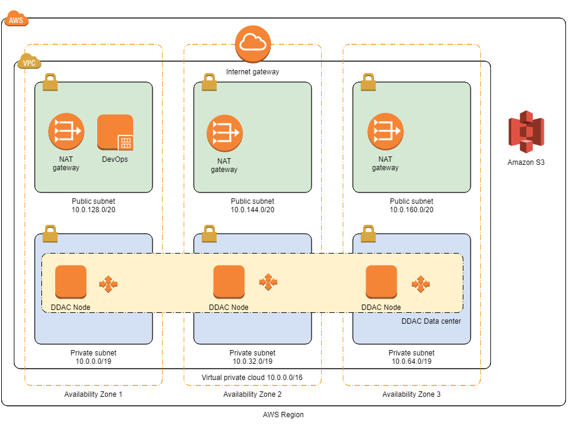
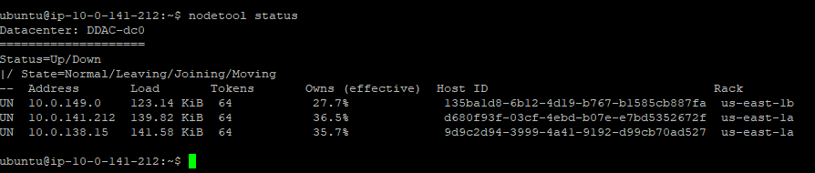

<H1>Apache Cassandra™ 4.0 on the AWS Cloud</H1>

<H2>Quick Start Reference Deployment</H2>

Jun 2020

DataStax, Inc.

AWS Quick Start Reference Team

&nbsp;
&nbsp;

- [Overview](#overview)
  - [Costs and Licenses](#costs-and-licenses)
- [Architecture](#architecture)
  - [Apache Cassandra Data Centers and Nodes](#apache-cassandra-data-centers-and-nodes)
- [Prerequisites](#prerequisites)
  - [Specialized Knowledge](#specialized-knowledge)
  - [Technical Requirements](#technical-requirements)
- [Deployment Options](#deployment-options)
- [Deployment Steps](#deployment-steps)
  - [Step 1. Prepare Your AWS Account](#step-1-prepare-your-aws-account)
  - [Step 2. Launch the Quick Start](#step-2-launch-the-quick-start)
  - [Step 3. Test the Deployment](#step-3-test-the-deployment)
  - [Step 4. Back up Your Data](#step-4-back-up-your-data)
- [Troubleshooting](#troubleshooting)
- [Additional Resources](#additional-resources)
  - [Send Us Feedback](#send-us-feedback)
  - [Document Revisions](#document-revisions)

This Quick Start deployment guide was created by Amazon Web Services (AWS) in partnership with DataStax, Inc.

# Overview

This Quick Start reference deployment guide provides step-by-step instructions for deploying Apache Cassandra 4.0 on the Amazon Web Services (AWS) Cloud.

As Apache Cassandra™ adoption grows within your organization, so could the challenges involved with using, maintaining, and supporting the technology. This can add considerable cost, complexity, and administrative burden. Apache Cassandra addresses these challenges by streamlining operations and controlling costs for all your Cassandra workloads.

You’ll have access to best-in-class, 100% open source Apache Cassandra software, as well as optional support and services from the experts that authored the majority of the Cassandra code.

[Quick Starts](https://aws.amazon.com/quickstart/?quickstart-all.q=datastax) are automated reference deployments that use AWS CloudFormation templates to launch, configure, and run the AWS compute, network, storage, and other services required to deploy a specific workload on AWS.

This Quick Start is for users who need an easily deployed Apache Cassandra cluster for development and or testing purposes

## Costs and Licenses

You are responsible for the cost of the AWS services used while running this Quick Start reference deployment. There is no additional cost for using the Quick Start.

The AWS CloudFormation template for this Quick Start includes configuration parameters that you can customize. Some of these settings, such as instance type, will affect the cost of deployment. For cost estimates, see the pricing pages for each AWS service you will be using.

This Quick Start includes Apache Cassandra 4.0.
&nbsp;

# Architecture

Deploying this Quick Start for a new virtual private cloud (VPC) with **default parameters** builds the following environment in the AWS Cloud.

<b>Figure 1: Quick Start architecture for Apache Cassandra on AWS</b>

The Quick Start sets up the following components. (The template that deploys the Quick Start into an existing VPC skips the components marked by asterisks.)

- A highly available architecture that spans three Availability Zones.\*
- A VPC configured with public and private subnets according to AWS best practices, to provide you with your own virtual network on AWS. For more information about the VPC infrastructure, see the [Amazon VPC Quick Start](https://aws.amazon.com/quickstart/architecture/vpc/).\*
- An Internet gateway to allow access to the Internet.\*
- Managed NAT gateways to allow outbound Internet access for resources in the private subnets.\*
- One EC2 instance in the public subnet running devOps apps, which can also be used as a jumpbox to ssh into Apache Cassandra nodes in the private subnet.
- Additional EC2 instances for Apache Cassandra nodes, depending on your Quick Start parameter settings. (By default, the Quick Start creates 3 Apache Cassandra nodes in private subnets (seednode1, seednode2 and seednode3).
- One Amazon Elastic Block Store (Amazon EBS) data volume per node instance deployed.

## Apache Cassandra Data Centers and Nodes

Apache Cassandra data centers are groups of nodes, related and configured within a cluster for replication purposes. The Quick Start creates 1 data center with 1 - 32 nodes.

Apache Cassandra stores data replicas on multiple nodes to ensure reliability and fault tolerance. A replication strategy determines the nodes where replicas are placed. The replication strategy is defined per keyspace, and is set during keyspace creation. This Quick Start places nodes in each AWS Availability Zone.
&nbsp;

# Prerequisites

## Specialized Knowledge

Before you deploy this Quick Start, we recommend that you become familiar with the following AWS services. (If you are new to AWS, see [Getting Started with AWS](https://docs.aws.amazon.com/gettingstarted/latest/awsgsg-intro/intro.html).)

- [Amazon VPC](https://aws.amazon.com/documentation/vpc/)
- [Amazon EC2](https://aws.amazon.com/documentation/ec2/)
- [Amazon EBS](https://docs.aws.amazon.com/AWSEC2/latest/UserGuide/AmazonEBS.html)

We also recommend that you become familiar with the features and configuration of Apache Cassandra.

- [Apache Cassandra documentation](https://cassandra.apache.org/doc/latest/new/index.html)

## Technical Requirements

This Quick Start uses a Linux AMI (Ubuntu 16.04 LTS) for EC2 instances, and creates EBS volumes and an S3 bucket. The account you run this Quick Start in must have authorization to create these resources.

# Deployment Options

This Quick Start provides two deployment options:

- **Deploy Apache Cassandra into a new VPC** (end-to-end deployment). This option builds a new AWS environment consisting of the VPC, subnets, NAT gateways, security groups, and other infrastructure components, and then deploys Apache Cassandra cluster into this new VPC.
- **Deploy Apache Cassandra into an existing VPC**. This option provisions Apache Cassandra cluster in your existing AWS VPC infrastructure.

The Quick Start provides separate templates for these options. It also lets you configure CIDR blocks, instance types, and Apache Cassandra settings, as discussed later in this guide.
&nbsp;

# Deployment Steps

## Step 1. Prepare Your AWS Account

1. If you don&#39;t already have an AWS account, create one at [https://aws.amazon.com](https://aws.amazon.com) by following the on-screen instructions.
2. Use the region selector in the navigation bar to choose the AWS Region where you want to deploy Apache Cassandra on AWS.
3. Create a [key pair](https://docs.aws.amazon.com/AWSEC2/latest/UserGuide/ec2-key-pairs.html) in your preferred region.
4. If necessary, [request a service limit increase](https://console.aws.amazon.com/support/home#/case/create?issueType=service-limit-increase&amp;limitType=service-code-) for the Amazon EC2 **m4.large** instance type. You might need to do this if you already have an existing deployment that uses this instance type, and you think you might exceed the [default limit](http://docs.aws.amazon.com/AWSEC2/latest/UserGuide/ec2-resource-limits.html) with this reference deployment.

## Step 2. Launch the Quick Start

> **Note**    You are responsible for the cost of the AWS services used while running this Quick Start reference deployment. There is no additional cost for using this Quick Start. For full details, see the pricing pages for each AWS service you will be using in this Quick Start. Prices are subject to change.

1. Choose one of the following options to launch the AWS CloudFormation template into your AWS account. For help choosing an option, see deployment options earlier in this guide.

| Option 1 - Deploy Apache Cassandra into a new VPC on AWS | Option 2 - Deploy Apache Cassandra into an existing VPC on AWS |
| :------------------------------------------: | :------------------------------------------------: |
|        [Launch](https://fwd.aws/mR5pP)       |           [Launch](https://fwd.aws/eq4AJ)          |

> **Important**     If you&#39;re deploying Apache Cassandra into an existing VPC, make sure that your VPC has three private subnets in different Availability Zones for the node instances. These subnets require [NAT gateways](https://docs.aws.amazon.com/vpc/latest/userguide/vpc-nat-gateway.html) or [NAT instances](https://docs.aws.amazon.com/vpc/latest/userguide/VPC_NAT_Instance.html) in their route tables, to allow the instances to download packages and software without exposing them to the Internet. You&#39;ll also need the domain name option configured in the DHCP options, as explained in the [Amazon VPC documentation](http://docs.aws.amazon.com/AmazonVPC/latest/UserGuide/VPC_DHCP_Options.html). You&#39;ll be prompted for your VPC settings when you launch the Quick Start.

Each deployment takes about 10-15 minutes to complete, depending on the size of the Apache Cassandra cluster to deploy.

1. Check the region that&#39;s displayed in the upper-right corner of the navigation bar, and change it if necessary. This is where the network infrastructure for Apache Cassandra will be built. The template is launched in the US East (Ohio) Region by default.
2. On the **Select Template** page, keep the default setting for the template URL, and then choose **Next**.
3. On the **Specify Details** page, change the stack name if needed. Review the parameters for the template. Provide values for the parameters that require input. For all other parameters, review the default settings and customize them as necessary. When you finish reviewing and customizing the parameters, choose **Next**.

In the following tables, parameters are listed by category and described separately for the two deployment options. Parameters for deploying Apache Cassandra into a new VPC and Parameters for deploying Apache Cassandra into an existing VPC

- **Option 1: Parameters for deploying Apache Cassandra into a new VPC**

[View template](https://fwd.aws/DyGDb)

_**VPC Network Configuration:**_

| Parameter label (name) | Default | Description |
| ---------------------- | :-----: | ----------- |
| Availability Zones (AvailabilityZones) | _Requires input_ | The list of Availability Zones to use for the subnets in the VPC. The Quick Start uses three Availability Zones from your list and preserves the logical order you specify. |
| CIDR for the new VPC (VPCCIDR) | 10.0.0.0/16 | CIDR block for the VPC. |
| Private Subnet 1 CIDR (PrivateSubnet1CIDR) | 10.0.0.0/19 | CIDR block for private subnet 1 located in Availability Zone 1. |
| Private Subnet 2 CIDR (PrivateSubnet2CIDR) | 10.0.32.0/19 | CIDR block for private subnet 2 located in Availability Zone 2. |
| Private Subnet 3 CIDR (PrivateSubnet3CIDR) | 10.0.64.0/19 | CIDR block for private subnet 3 located in Availability Zone 3. |
| Public Subnet 1 CIDR (PublicSubnet1CIDR) | 10.0.128.0/20 | CIDR block for the public (DMZ) subnet 1 located in Availability Zone 1. |
| Public Subnet 2 CIDR (PublicSubnet2CIDR) | 10.0.144.0/20 | CIDR block for the public (DMZ) subnet 2 located in Availability Zone 2. |
| Public Subnet 3 CIDR (PublicSubnet3CIDR) | 10.0.160.0/20 | CIDR block for the public (DMZ) subnet 3 located in Availability Zone 3. |

_**Apache Cassandra Cluster/Nodes Configuration:**_

| Parameter label (name) | Default | Description |
| ---------------------- | :-----: | ----------- |
| Apache Cassandra Version (OSSVersion) | 4.0 | Apache Cassandra version to install . |
| Number of nodes to install (ClusterSize) | 3 | Choose from "1 - 32" for number of cassandra nodes to install.|
| Cluster Name (ClusterName) | Cassandra-Cluster | The name of the Apache Cassandra cluster. |
| Data Center Name (DatacenterName) | OSS-dc0 | Name of the Apache Cassandra data center. |
| Node Instance Type (NodeInstanceType) | m4.large | EC2 instance type for Apache Cassandra nodes. |
| Node Volume Size (NodeVolumeSize) | 512 | EBS volume size of the Apache Cassandra Cluster Nodes in GB. |

_**Cassandra Cluster Access:**_
| Parameter label (name) | Default | Description |
| ---------------------- | :-----: | ----------- |
| Create Cluster in Public Subnet (CreateClusterWithPublicIP) | false | Should create the Apache Cassandra Cluster nodes in public subnet. |
| Permitted IP range (RemoteAccessCIDR) | _Requires input_ | The CIDR IP range that is permitted to SSH to the DevOps EC2 instance for the console. We recommend that you set this value to a trusted IP range. For example, you might want to grant only your corporate network access to the software. |
| Key Name (KeyPairName) | _Requires input_ | Public/private key pair, which allows you to connect securely to your instance after it launches. When you created an AWS account, this is the key pair you created in your preferred region. |

_**DevOps Configuration:**_
| Parameter label (name) | Default | Description |
| ---------------------- | :-----: | ----------- |
| Instance Type (DevInstanceType) | t3.medium | EC2 instance type for the DevOps Host.  |
| Volume Sizes (DevVolumeSize) | 16 | The EBS volume size, in GiB, for the DevOps Host. |

_**AWS Quick Start Configuration:**_

| Parameter label (name) | Default | Description |
| ---------------------- | :-----: | ----------- |
| Quick Start S3 Bucket Name (S3BucketName) | aws-quickstart | S3 bucket where the Quick Start templates and scripts are installed. Use this parameter to specify the S3 bucket name you&#39;ve created for your copy of Quick Start assets, if you decide to customize or extend the Quick Start for your own use. The bucket name can include numbers, lowercase letters, uppercase letters, and hyphens, but should not start or end with a hyphen. |
| Quick Start S3 Key Prefix (S3KeyPrefix) | quickstart-datastax-oss | The [S3 key name prefix](https://docs.aws.amazon.com/AmazonS3/latest/dev/UsingMetadata.html) used to simulate a folder for your copy of Quick Start assets, if you decide to customize or extend the Quick Start for your own use. This prefix can include numbers, lowercase letters, uppercase letters, hyphens, and forward slashes. |

 

- **Option 2: Parameters for deploying Apache Cassandra into an existing VPC**

[View template](https://fwd.aws/Dz54E)

_**VPC Network Configuration:**_

| Parameter label (name) | Default | Description |
| ---------------------- | :-----: | ----------- |
| VPC ID (VPCId) | _Requires input_ | Choose an existing VPC ID to deploy the cluster into. |
| CIDR for the VPC (VPCCIDR) | 10.0.0.0/16 | CIDR block for the VPC. |
| Private Subnet 1 ID (PrivateSubnet1ID) | _Requires input_ | Subnet ID for private subnet 1 located in Availability Zone 1. |
| Private Subnet 2 ID (PrivateSubnet2ID) | _Requires input_ | Subnet ID for private subnet 2 located in Availability Zone 2. |
| Private Subnet 3 ID (PrivateSubnet3ID) | _Requires input_ | Subnet ID for private subnet 3 located in Availability Zone 3. |
| Public Subnet 1 ID (PublicSubnet1CIDR) | _Requires input_ | Subnet ID for the public (DMZ) subnet 1 located in Availability Zone 1. |
| Public Subnet 2 ID (PublicSubnet2CIDR) | _Requires input_ | Subnet ID for the public (DMZ) subnet 2 located in Availability Zone 2. |
| Public Subnet 3 ID (PublicSubnet3CIDR) | _Requires input_ | Subnet ID for the public (DMZ) subnet 3 located in Availability Zone 3. |

_**Apache Cassandra Cluster/Nodes Configuration:**_

| Parameter label (name) | Default | Description |
| ---------------------- | :-----: | ----------- |
| Apache Cassandra Version (OSSVersion) | 4.0 | Apache Cassandra version to install . |
| Number of nodes to install (ClusterSize) | 3 | Choose from "1 - 32" for number of cassandra nodes to install.|
| Cluster Name (ClusterName) | Cassandra-Cluster | The name of the Apache Cassandra cluster. |
| Data Center Name (DatacenterName) | OSS-dc0 | Name of the Apache Cassandra data center. |
| Node Instance Type (NodeInstanceType) | m4.large | EC2 instance type for Apache Cassandra nodes. |
| Node Volume Size (NodeVolumeSize) | 512 | EBS volume size of the Apache Cassandra Cluster Nodes in GB. |

_**Cassandra Cluster Access:**_
| Parameter label (name) | Default | Description |
| ---------------------- | :-----: | ----------- |
| Create Cluster in Public Subnet (CreateClusterWithPublicIP) | false | Should create the Apache Cassandra Cluster nodes in public subnet. |
| Permitted IP range (RemoteAccessCIDR) | _Requires input_ | The CIDR IP range that is permitted to SSH to the DevOps EC2 instance for the console. We recommend that you set this value to a trusted IP range. For example, you might want to grant only your corporate network access to the software. |
| Key Name (KeyPairName) | _Requires input_ | Public/private key pair, which allows you to connect securely to your instance after it launches. When you created an AWS account, this is the key pair you created in your preferred region. |

_**DevOps Configuration:**_
| Parameter label (name) | Default | Description |
| ---------------------- | :-----: | ----------- |
| Instance Type (DevInstanceType) | t3.medium | EC2 instance type for the DevOps Host.  |
| Volume Sizes (DevVolumeSize) | 16 | The EBS volume size, in GiB, for the DevOps Host. |

_**AWS Quick Start Configuration:**_

| Parameter label (name) | Default | Description |
| ---------------------- | :-----: | ----------- |
| Quick Start S3 Bucket Name (S3BucketName) | aws-quickstart | S3 bucket where the Quick Start templates and scripts are installed. Use this parameter to specify the S3 bucket name you&#39;ve created for your copy of Quick Start assets, if you decide to customize or extend the Quick Start for your own use. The bucket name can include numbers, lowercase letters, uppercase letters, and hyphens, but should not start or end with a hyphen. |
| Quick Start S3 Key Prefix (S3KeyPrefix) | quickstart-datastax-oss | The [S3 key name prefix](https://docs.aws.amazon.com/AmazonS3/latest/dev/UsingMetadata.html) used to simulate a folder for your copy of Quick Start assets, if you decide to customize or extend the Quick Start for your own use. This prefix can include numbers, lowercase letters, uppercase letters, hyphens, and forward slashes. |

1. On the **Options** page, you can [specify tags](https://docs.aws.amazon.com/AWSCloudFormation/latest/UserGuide/aws-properties-resource-tags.html) (key-value pairs) for resources in your stack and [set advanced options](https://docs.aws.amazon.com/AWSCloudFormation/latest/UserGuide/cfn-console-add-tags.html). When you&#39;re done, choose **Next**.
2. On the **Review** page, review and confirm the template settings. Under **Capabilities** , select the check box to acknowledge that the template will create IAM resources.
3. Choose **Create** to deploy the stack.
4. Monitor the status of the stack.

This deployment uses nested stacks. In addition to the root stack, you&#39;ll see a VPC stack (if you choose to deploy the Quick Start into a new VPC) and multiple stacks for nodes and devops/bastion node. When the status of the root stack is **CREATE\_COMPLETE** , the installation of Apache Cassandra Cluster is complete, all node instances have been created, and Apache Cassandra Cluster is ready.

1. Use the _DevUrl_ displayed in the **Outputs** tab for the stack to view the Apache Cassandra developer resource site.

> **Important:** We recommend deployment into a new VPC (Option 1). For production environments, we recommend that you place the cluster in private subnet (CreateClusterWithPublicIP=false).

## Step 3. Test the Deployment

After you deploy the Apache Cassandra cluster, the quickest way to begin using the cluster is to use SSH to connect to the DevOps instance and then to one of the node instances. You can use [SSH agent forwarding](https://aws.amazon.com/blogs/security/securely-connect-to-linux-instances-running-in-a-private-amazon-vpc/) using the key pair (replacing the KEY_FILE and DevIpAddress values for those of your cluster):

You can get the ip addresses of the nodes from the output tab of the stack.

~~~shell
ssh -i $KEY_FILE ubuntu@$DevIpAddress
~~~

You can get the Seed1PrivateIpAddress from the output tab of the stack.

Once logged into the DevOps instance, run

~~~shell
ssh -i $KEY_FILE ubuntu@$Seed1PrivateIpAddress
~~~

You can then view the status of the Apache Cassandra Cluster:
~~~shell
~$ nodetool status
~~~

For a 6 node cluster, the nodetool status should be like

The Developer resource web site is accessible at DevUrl shown in the outputs.

## Step 4. Back up Your Data

Apache Cassandra backs up data by taking a snapshot of all on-disk data files (SSTable files) stored in the data directory. You can take a snapshot of all keyspaces, a single keyspace, or a single table while the system is online. See [Backing up and Restoring data](https://cassandra.apache.org/doc/latest/operating/backups.html).
For storing the backups in AWS S3, see [Backup to S3](https://aws.amazon.com/getting-started/tutorials/backup-to-s3-cli/)
&nbsp;

# Troubleshooting

**Q.** I encountered a CREATE\_FAILED error when I launched the Quick Start. What should I do?

**A.** If AWS CloudFormation fails to create the stack, we recommend that you relaunch the template with **Rollback on failure** set to **No**. (This setting is under **Advanced** in the AWS CloudFormation console, **Options** page.) With this setting, the stack&#39;s state will be retained and the instance will be left running, so you can troubleshoot the issue. (You&#39;ll want to look at the log files in %ProgramFiles%\Amazon\EC2ConfigService and C:\cfn\log.)

> **Important**   When you set **Rollback on failure** to **No** , you&#39;ll continue to incur AWS charges for this stack. Please make sure to delete the stack when you&#39;ve finished troubleshooting.

For additional information, see [Troubleshooting AWS CloudFormation](https://docs.aws.amazon.com/AWSCloudFormation/latest/UserGuide/troubleshooting.html) on the AWS website or contact us on the [AWS Quick Start Discussion Forum](https://forums.aws.amazon.com/forum.jspa?forumID=178).

**Q.** I encountered a size limitation error when I deployed the AWS Cloudformation templates.

**A.** We recommend that you launch the Quick Start templates from the location we&#39;ve provided or from another S3 bucket. If you deploy the templates from a local copy on your computer, you might encounter template size limitations when you create the stack. For more information about AWS CloudFormation limits, see the [AWS documentation](http://docs.aws.amazon.com/AWSCloudFormation/latest/UserGuide/cloudformation-limits.html).
&nbsp;

# Additional Resources

**AWS services**

- AWS CloudFormation
[https://aws.amazon.com/documentation/cloudformation/](https://aws.amazon.com/documentation/cloudformation/)
- Amazon EC2
[https://docs.aws.amazon.com/AWSEC2/latest/WindowsGuide/](https://docs.aws.amazon.com/AWSEC2/latest/WindowsGuide/)
- Amazon VPC
[https://aws.amazon.com/documentation/vpc/](https://aws.amazon.com/documentation/vpc/)

**Apache Cassandra**

- Apache Cassandra documentation
[https://cassandra.apache.org/doc/latest/new/index.html](https://cassandra.apache.org/doc/latest/new/index.html)
- DataStax Academy online courses and tutorials
[https://academy.datastax.com/](https://academy.datastax.com/)

**Quick Start reference deployments**

- AWS Quick Start home page
[https://aws.amazon.com/quickstart/](https://aws.amazon.com/quickstart/)
&nbsp;

## Send Us Feedback

You can visit our [GitHub repository](https://github.com/aws-quickstart/quickstart-datastax-oss) to download the templates and scripts for this Quick Start, to post your comments, and to share your customizations with others.
&nbsp;

## Document Revisions

| Date | Change | In sections |
| --- | --- | --- |
| Jun 2020 | Initial publication | — |

 
 
 
 
 
 
© 2018, Amazon Web Services, Inc. or its affiliates, and DataStax, Inc. All rights reserved.

<u>**Notices**</u>

This document is provided for informational purposes only. It represents AWS’s current product offerings and practices as of the date of issue of this document, which are subject to change without notice. Customers are responsible for making their own independent assessment of the information in this document and any use of AWS’s products or services, each of which is provided “as is” without warranty of any kind, whether express or implied. This document does not create any warranties, representations, contractual commitments, conditions or assurances from AWS, its affiliates, suppliers or licensors. The responsibilities and liabilities of AWS to its customers are controlled by AWS agreements, and this document is not part of, nor does it modify, any agreement between AWS and its customers.

The software included with this paper is licensed under the Apache License, Version 2.0 (the "License"). You may not use this file except in compliance with the License. A copy of the License is located at [http://aws.amazon.com/apache2.0/](http://aws.amazon.com/apache2.0/) or in the "license" file accompanying this file. This code is distributed on an "AS IS" BASIS, WITHOUT WARRANTIES OR CONDITIONS OF ANY KIND, either express or implied. See the License for the specific language governing permissions and limitations under the License.
