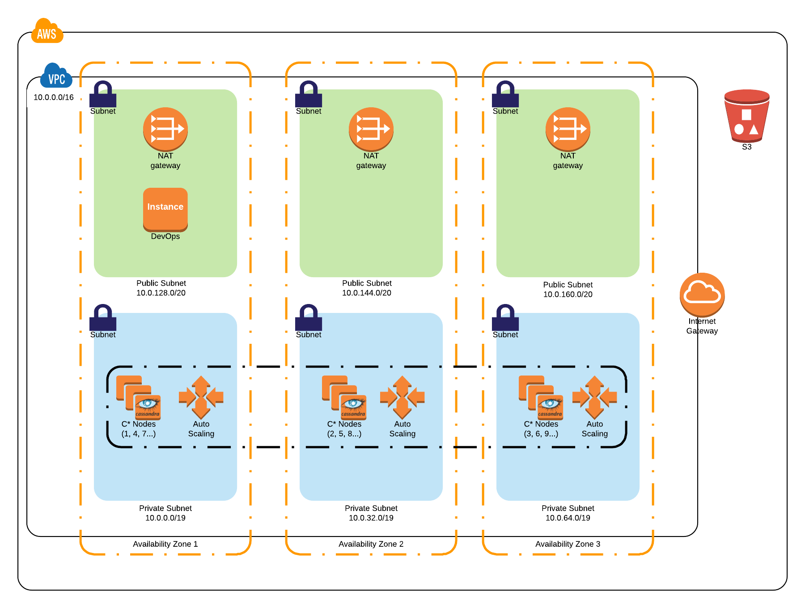

Deploying this Quick Start for a new virtual private cloud (VPC) with
*default parameters* builds the following _{partner-product-name}_ environment in the
AWS Cloud.

// Replace this example diagram with your own. Send us your source PowerPoint file. Be sure to follow our guidelines here : http://(we should include these points on our contributors giude)
[#architecture1]
.Quick Start architecture for _{partner-product-name}_ on AWS
[link=images/architecture_diagram.png]

As shown in Figure 1, the Quick Start sets up the following:

## In the public subnets:

* A highly available architecture that spans three Availability Zones.*

* A VPC configured with public and private subnets, according to AWS best practices, to provide you with your own virtual network on AWS.*

## In the private subnets:

* Amazon Elastic Compute Cloud (Amazon EC2)
 - Seed Nodes - Seed nodes are used to bootstrap the gossip process for new nodes joining a cluster (The inital E22 instances that are out side of the ASG that assist in bootstraping the cluster).
 - C* Nodes - "c" refers to Cassandra Nodes that are not seed nodes and the 4th node onwards are part of the Auto Scaling group. Making every node a seed node is not recommended because of increased maintenance and reduced gossip performance. Gossip optimization is not critical, but it is recommended to use a small seed list.

* Auto Scaling groups used for scaling {partner-product-name-short} nodes in the private subnets based on workload demand.

* Managed network address translation (NAT) gateways to allow outbound internet access for resources in the private subnets.*

*The template that deploys the Quick Start into an existing VPC skips
the components marked by asterisks and prompts you for your existing VPC
configuration.
